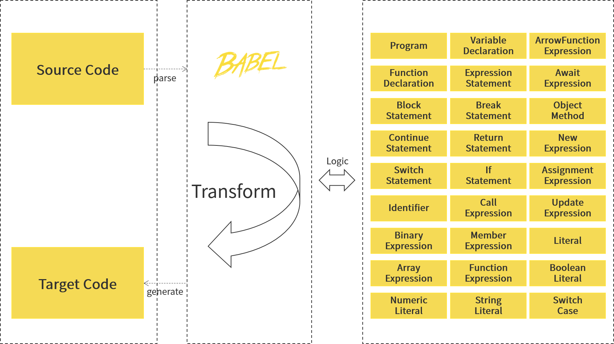

<p align="center">
  <a href="https://github.com/vleedesigntheory/babel-plugin-testus" title="TestUS Babel Plugin"></a>
</p>

# babel-plugin-testus

> A Babel Plugin for TestUS

## Principle

The whole plugin complies with the architectural design system of `Babel`, and performs corresponding syntax transformation on the source code through procedural steps.


The technical selection uses various dependency packages required by `Babel` to handle Babel 6.x and Babel 7.x, including: `parser`, `traverse`, and `generator` etc.



## Example

By configuring the `plugins` in `babel.config.js` or `.babelrc`, introduce `babel-plugin-testus` to realize syntax transformation. The configuration is as follows:

```js
// babel.config.js
module.exports = {
    "plugins": [
        "babel-plugin-testus"
    ]
}
```

Before: 

```js
// @testus
const sum = (a,b) => a+b;
```

After:

```js
/**
 * @testus 
 * @name sum
 * @param a
 * @param b
 * @testus
 */
const sum = (a,b) => a+b;
```

## License

[MIT](http://opensource.org/licenses/MIT)

Copyright (c) 2023-present VLeeDesignTheory


